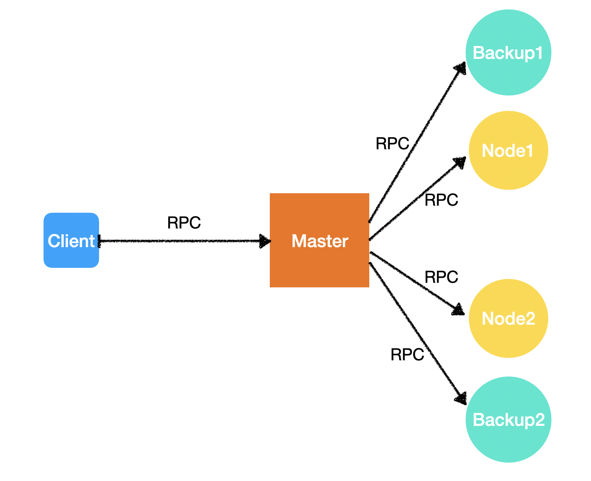
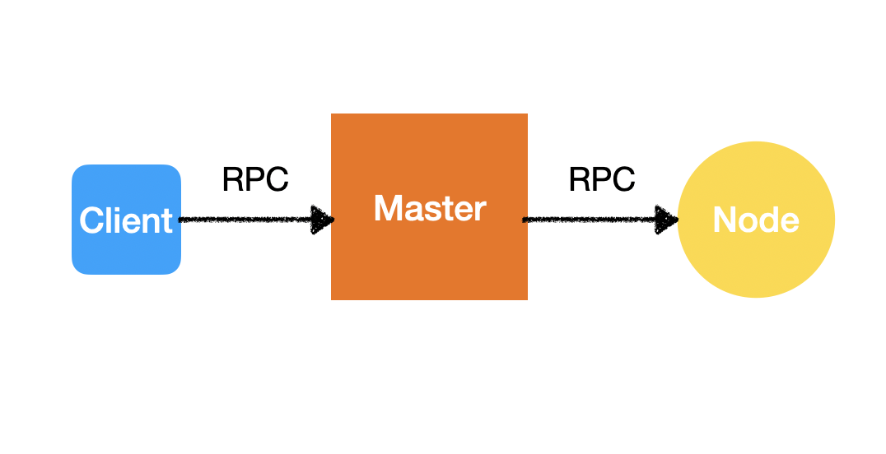
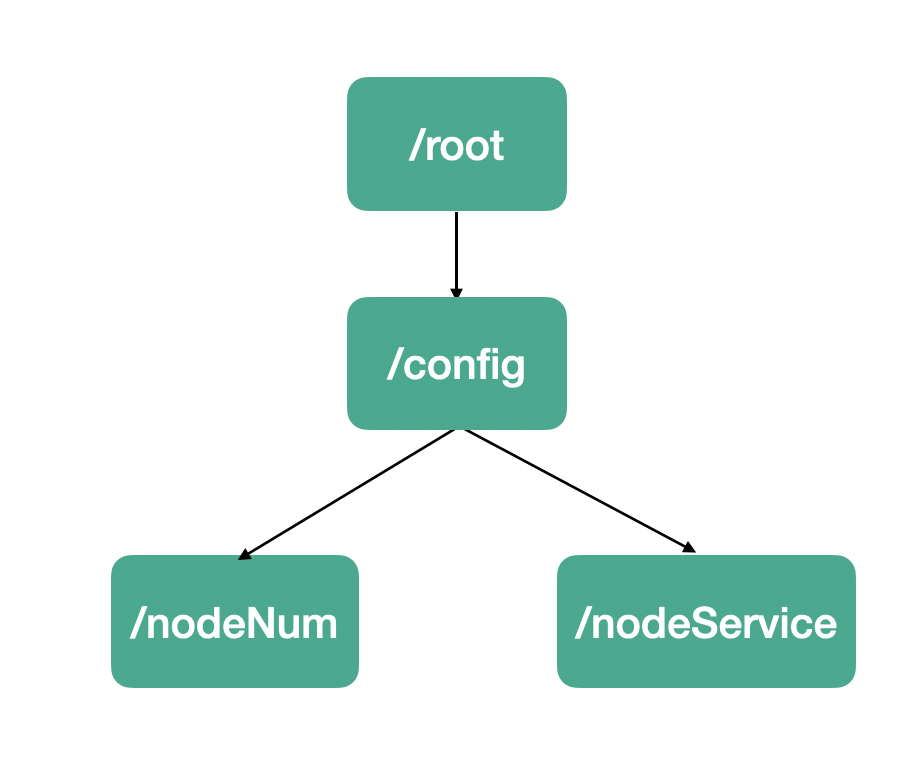
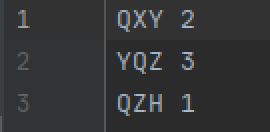
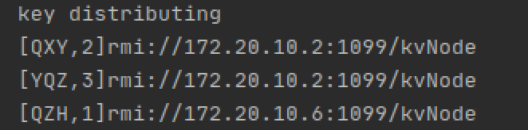
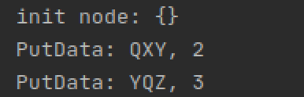
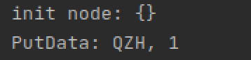
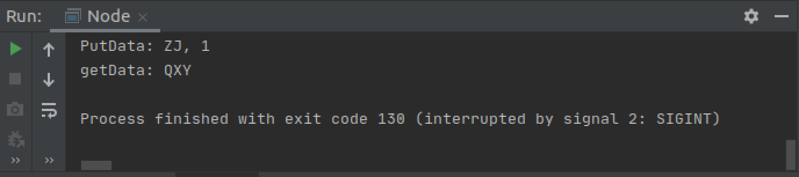
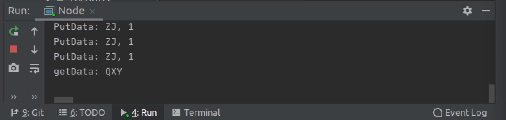

# Key-Value Storage System

516072910066 钱星月

# 一、总体设计：

​	

Client：用户角色，负责发送PUT、READ、DELETE请求。

Master：负责初始化整个存储集群，负责分发来自Client的请求，负责在node数量变化时管理集群做出相应对策

Node：负责存储数据，负责新增、查询、删除数据的任务。

Backup：Node的备份，当node出错时Master将指定它们替代node，成为新的node。

## 二、环境搭建

操作系统：Ubuntu 18.04

开发工具：Intellij IDEA

工具：zookeeper，Java RMI

### 搭建过程：

1. zookeeper搭建：

   - 下载某一版本的zookeeper安装包

   - 解压至某一路径

   - 在conf/目录下创建zoo.cfg

     ```shell
     # The number of milliseconds of each tick
     tickTime=2000
     # The number of ticks that the initial 
     # synchronization phase can take
     initLimit=10
     # The number of ticks that can pass between 
     # sending a request and getting an acknowledgement
     syncLimit=5
     # the directory where the snapshot is stored.
     # do not use /tmp for storage, /tmp here is just 
     # example sakes.
     dataDir=/opt/module/zookeeper1/zkData
     dataLogDir=/opt/module/zookeeper1/zkLog
     # the port at which the clients will connect
     clientPort=2181
     # zookeeper集群的配置
     server.1=172.20.10.2:2287:3387
     server.2=172.20.10.4:2287:3387
     # the maximum number of client connections.
     # increase this if you need to handle more clients
     #maxClientCnxns=60
     #
     # Be sure to read the maintenance section of the 
     # administrator guide before turning on autopurge.
     #
     # http://zookeeper.apache.org/doc/current/zookeeperAdmin.html#sc_maintenance
     #
     # The number of snapshots to retain in dataDir
     #autopurge.snapRetainCount=3
     # Purge task interval in hours
     # Set to "0" to disable auto purge feature
     #autopurge.purgeInterval=1
     ```

     - 在zookeeper根目录创建zkData/和zkLog/两个文件夹用于存放数据和log
     - 之后在bin/文件夹下运行

     ```shell
     ./zkServer.sh start
     ```

   2. Java连接zookeeper：

      ```java
      CountDownLatch countDownLatch = new CountDownLatch(1);
      zooKeeper = new ZooKeeper("172.20.10.4:2181", 500, new ZKConnectionWatcher());
      countDownLatch.await();
      
      //读取并监听
      String nodeServer = new String(zooKeeper.getData("/config/nodeService", true, null));
      ```

   3. Java监听zookeeper的数据变化处理函数

      创建一个ZKConnectionWatcher类实现zookeeper的Watcher，并在其中的processor中写入数据变化的处理函数。

      并在连接zookeeper的时候，new一个ZKConnectionWatcher作为参数传入new ZooKeeper()。

      还需在读取数据时第二个参数传入true，表示程序监听此数据的变化，每当变化时，就会运行processor中的处理函数。

      (由于代码太长就不放代码了)

   4. Java RMI的使用

      ```java
      // 注册服务
      // 本地主机上的远程对象注册表Registry的实例
      LocateRegistry.createRegistry(1099);
      // 创建一个远程对象
      NodeService node = new NodeServiceImpl();
      // 把远程对象注册到RMI注册服务器上，并命名为kvNode
      Naming.bind("kvNode", node);
      
      // 查找服务
      NodeService node = (NodeService) Naming.lookup(rmiPaths[i]);
      node.init(new HashMap<String, String>());
      ```

      

## 三、开发过程

采用增量式开发，从简单到复杂

### 第一步 构建一个简单的Client --> Master --> Node的结构：



使用Java的RMI发送RPC。现在本地试验，熟悉RMI的用法。

Master接口：

```java
public interface MasterService extends Remote {
    public void PUT(String key, String value) throws RemoteException;

    public String READ(String key) throws RemoteException;

    public void DELETE(String key) throws RemoteException;
}
```

Node接口：

```java
public interface NodeService extends Remote {
    void init(Map initValues) throws RemoteException;
    String getData(String key) throws RemoteException;
    void putData(String key, String value) throws RemoteException;
    void deleteData(String key) throws RemoteException;
}
```

Master接口实现方式：

```java
public void PUT(String key, String value) throws RemoteException {
        NodeService node = (NodeService) Naming.lookup("rmi://localhost:1099/kvNode");
        node.putData(key, value);
    }

    public String READ(String key) throws RemoteException {
        NodeService node = (NodeService) Naming.lookup("rmi://localhost:1099/kvNode");
        result =  node.getData(key);
        return result;
    }

    public void DELETE(String key) throws RemoteException {
        NodeService node = (NodeService) Naming.lookup("rmi://localhost:1099/kvNode");
        node.deleteData(key);
    }
```

最后client通过远程调用MasterService的函数，向Node节点写入、读取、删除数据。

### 第二步 加入Zookeeper管理RPC服务绑定的地址

由于地址是在代码中写死的，现在我们用zookeeper来管理。

zookeeper存储数据的结构：



- /config/nodeNum: Data Node的个数。每个节点启动时就将这个数加一。
- /config/nodeService: Data Node绑定的RPC路径，以空格隔开。每个节点启动时将自己的路径append在它后面。

处理流程：

1. Master启动，此时还没有node，所以它读到的nodeNum为0，nodeService为空。Master监听着nodeNum和nodeService
2. 一个node启动，更新nodeNum和nodeService
3. Master监听到zookeeper 的 datanode 发生变化，读取持久化的数据文件“data.txt”，并将数据通过远程调用分配到node上。此时远程调用的路径从zookeeper上获取。
4. Client向Master发送创建、查询、删除数据的远程调用，Master将调用node的相关函数，对node存放的数据进行操作。

Master的watcher类：

```java
public class ZKConnectionWatcher implements Watcher {
    public static ZooKeeper zooKeeper;
    public static CountDownLatch countDownLatch = new CountDownLatch(1);

    MasterServiceImpl master;
    String[] rmiPaths;
    Integer nodeNum = 0;

    public void initValue() {
        try {
            zooKeeper = new ZooKeeper("172.20.10.2:2181", 500, this);
            countDownLatch.await();

            zooKeeper.setData("/config/nodeNum", "0".getBytes(), -1);
            zooKeeper.setData("/config/nodeService", "".getBytes(), -1);

            byte[] nodeNum = zooKeeper.getData("/config/nodeNum", false, null);

            this.nodeNum = Integer.valueOf(new String(nodeNum)).intValue();
            String nodeServer = new String(zooKeeper.getData("/config/nodeService", true, null));
            rmiPaths = nodeServer.split(" ");
            System.out.println("nodeNum: "+ this.nodeNum);
            System.out.println("rmiPaths: ");
            for(int i=0;i<this.rmiPaths.length;i++)
            {
                System.out.println(this.rmiPaths[i]);
            }

        } catch (Exception e) {
            e.printStackTrace();
        }
    }

    public ZKConnectionWatcher(MasterServiceImpl masterService) {
        this.master = masterService;
        initValue();
        masterInit();
    }

    public void masterInit() {
        this.master.nodeNum = this.nodeNum;
        this.master.rmiPaths = this.rmiPaths;
        try {
            this.master.init();
        } catch (Exception e) {
            e.printStackTrace();
        }
    }

    public void process(WatchedEvent watchedEvent) {
        try {
          //检查连接情况
            if (watchedEvent.getType() == Event.EventType.None) {
                if (watchedEvent.getState() == Event.KeeperState.SyncConnected) {
                    System.out.println("connected successfully.");
                    countDownLatch.countDown();
                } else if (watchedEvent.getState() == Event.KeeperState.Disconnected) {
                    System.out.println("connect failed");
                } else if (watchedEvent.getState() == Event.KeeperState.Expired) {
                    System.out.println("time out");
                } else if (watchedEvent.getState() == Event.KeeperState.AuthFailed) {
                    System.out.println("auth failed");
                }
            } else if (watchedEvent.getType() == Event.EventType.NodeDataChanged) {
              //检测到数据变化
              	// 1.读取新的nodeNum
                System.out.println("Node Data changed");
                byte[] nodeNum = zooKeeper.getData("/config/nodeNum", false, null);
                this.nodeNum = Integer.valueOf(new String(nodeNum)).intValue();
              	// 2. 读取新的rmi路径
                String nodeServer = new String(zooKeeper.getData("/config/nodeService", true, null));
                rmiPaths = nodeServer.split(" ");
              
              	// 重新分配数据
                this.master.nodeNum = this.nodeNum;
                this.master.rmiPaths = this.rmiPaths;
                this.master.distributeKeys();
            }

        } catch (Exception e) {
            e.printStackTrace();
        }

    }
}
```

### 第三步 多个node的情况

在上一步的基础上，修改NodeDataChanged的处理程序。当节点数目发生变化时，重新分配数据，计算key的hashcode决定将key分配到哪个Node

MasterServiceImpl.distributeKehs( ):

```java
public void distributeKeys() {
  //当nodeNum发生变化时，重新分配数据
        System.out.println("key distributing");
        if (this.nodeNum != 0) {
          // 初始化每个node
            for (int i = 0; i < nodeNum; i++) {
                try {
                    NodeService node = (NodeService) Naming.lookup(rmiPaths[i]);
                    node.init(new HashMap<String, String>());
                } catch (Exception e) {
                    e.printStackTrace();
                }
            }
          
          //根据key的hashcode分配到node
            Set<String> keySet = kvs.keySet(); //kvs是Master持有的数据集合，相当于数据的完整备份，必要时持久化成文件
            for (String key : keySet) {
                String value = kvs.get(key).toString();
                Integer index = key.hashCode() % nodeNum;
                try {
                    System.out.println("["+key+","+value+"]"+rmiPaths[index]);
                    NodeService node = (NodeService) Naming.lookup(rmiPaths[index]);
                    node.putData(key, value);
                } catch (Exception e) {
                    e.printStackTrace();
                }
            }
        }
    }
```

**执行结果：**

- data.txt：用于集群初始化的数据

  

- Master在2个node节点情况下分配数据：

  

- node1节点执行情况：

  

- node2节点执行情况：

  

至此已完成了key-value store的雏形，最后一步就是加入backup，并让Master在node不可用情况下替换成相应的backup。

### 第四步 加入backup机制

是否为backup不为node自己觉得，而是Master根据node的数量，选取一部分作为node，一部分作为backup。决定方式：

1. 如果nodeNum < 2, 则全部为普通node
2. 如果nodeNum > 2且为偶数，那么一半是普通node，一半是backup node
3. 如果nodeNum > 2且为奇数，则n/2 + 1为普通node，n/2为backup node，且最后一个普通node没有对应的backup。

```java
public void process(WatchedEvent watchedEvent) {
        try {
            ...
            } else if (watchedEvent.getType() == Event.EventType.NodeDataChanged) {
          	//监听到nodeNum变化
                System.out.println("Node Data changed");
                byte[] nodeNum = zooKeeper.getData("/config/nodeNum", false, null);
                this.nodeNum = Integer.valueOf(new String(nodeNum)).intValue();
                String nodeServer = new String(zooKeeper.getData("/config/nodeService", true, null));
                rmiPaths = nodeServer.split(" ");
								// Master决定谁是普通node，谁是backup
                if (this.nodeNum <= 2) {
                    this.master.rmiPaths = this.rmiPaths;
                    this.master.normalNodeNum = this.nodeNum;
                    this.master.backupNodeNum = 0;
                } else {
                    Integer backupNodeNum = this.nodeNum / 2;
                    Integer normalNodeNum = this.nodeNum - backupNodeNum;
                    this.master.normalNodeNum = normalNodeNum;
                    this.master.backupNodeNum = backupNodeNum;

                    this.master.rmiPaths = new String[normalNodeNum];
                    this.master.backupRmiPaths = new String[backupNodeNum];
                    for (int i = 0; i < this.rmiPaths.length; i++) {
                        if (i < normalNodeNum) {
                          //普通node
                            this.master.rmiPaths[i] = rmiPaths[i];
                        } else {
                          //backup node
                            this.master.backupRmiPaths[i-normalNodeNum] = rmiPaths[i];
                        }
                    }

                }

                this.master.distributeKeys();
            }

        } catch (Exception e) {
            e.printStackTrace();
        }

    }
```


Master的抉择：

1. Master通过两个数组管理node，一个是普通 node的rmi路径数组，一个是backup node的rmi路径数组。
2. 当操作某node发生Exception时，Master将普通node的rmi路径替换成backup node的rmi路径
3. 为了保证node和其backup的数据同步，在初始化node时，Master向node和它的backup分配同样的数据。Master将同时调用普通node和它的backup putData和deleteData函数。

**测试backup切换：**

​	首先运行master、4个node，其中2个node会被master分配为backup。

​	先让Client进行一些操作，关掉其中一个node，再让Client重试一遍。

​	node1:



Master对node1进行了两个操作：putData("ZJ", "1")和getData("QXY");

杀掉node1的进程，Client再次向master发送同样的请求。backup1有如下输出：



发现backup1替代了原来的node1。细心的你可能发现竟然出现了3次putData，第一次putData是同node1的putData一起执行的。前面说过，为了保证node和backnode的一致性，它们必须同时写入或删除数据。但由于Java的Map性质，putData执行多次结果还是一样，所以不影响正确性。


至此我们已经实现了最初的设计。但还有一个问题需要解决：并发

### 最后一步 处理并发

若是多个client同时对系统进行读写，如何保证正确性和一致性呢？我的解决方式是：使用锁

而竞争区的最小粒度应该是数据行，所有锁需要在node内实现。当遇到同时访问同一行数据的请求时，先那到锁的执行，后面的依次排队拿锁执行。

NodeServiceImpl：

```java
public class NodeServiceImpl extends UnicastRemoteObject implements NodeService {
    Map store;
  // 粒度为数据行的锁
    Map<String, Lock> locks;
  // 一个大锁
    Lock globalLock;

    public NodeServiceImpl()  throws RemoteException{
        store = new HashMap<String, String>();
        locks = new HashMap<String, Lock>();
        globalLock = new ReentrantLock();
    }

    public void init(Map initValues) throws RemoteException {
        System.out.println("init node: "+ initValues.toString());
        store = new HashMap(initValues);
        Set<String> keySet = store.keySet();
        for (String key : keySet) {
            locks.put(key, new ReentrantLock());
        }
    }

    public String getData(String key) throws RemoteException {
        if (locks.containsKey(key)) {
            Lock lock = locks.get(key);
            lock.lock();
            System.out.println("getData: " + key);
            String result = store.get(key).toString();
            lock.unlock();
            return result;
        } else {
            globalLock.lock();
            System.out.println("getData: " + key);
            String result = store.get(key).toString();
            globalLock.unlock();
            return result;
        }
    }
    public void putData(String key, String value) throws RemoteException {
        if (locks.containsKey(key)) {
            Lock lock = locks.get(key);
            lock.lock();
            System.out.println("PutData: " + key + ", " + value);
            store.put(key, value);
            lock.unlock();
        } else {
            globalLock.lock();
            System.out.println("PutData: " + key + ", " + value);
            store.put(key, value);
            locks.put(key, new ReentrantLock());
            globalLock.unlock();
        }
    }
    public void deleteData(String key) throws RemoteException {
        if (locks.containsKey(key)) {
            Lock lock = locks.get(key);
            lock.lock();
            System.out.println("deleteData: " + key);
            store.remove(key);
            lock.unlock();
        } else {
            globalLock.lock();
            System.out.println("deleteData: " + key);
            store.remove(key);
            globalLock.unlock();
        }
    }
}
```

由于数据行的锁是跟数据行一起产生的，所以在执行操作前，我们需要判断是否有这个数据行对应的锁：

1. 若有，则排队拿锁操作。
2. 若没有，情况就比较复杂，有可能发生同时写入同一数据行的情况。在这种情况下，使用全局锁来保证并发的正确性。
3. 数据行对应的锁并不随着数据行的删除而删除，这是为了简化实现。

